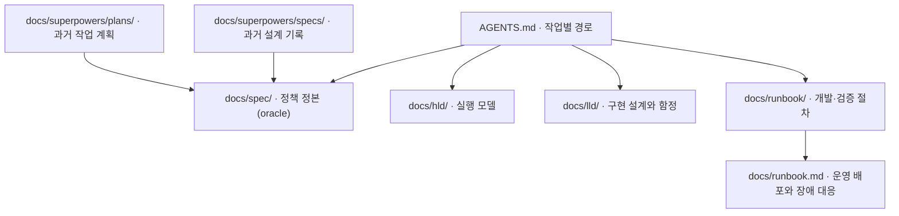

# 문서 안내

작업할 파일에 맞는 문서만 읽습니다. 공통 규칙과 경로는 루트의 `AGENTS.md`에 있습니다.

```mermaid
flowchart TD
    A["AGENTS.md · 작업별 경로"]
    A --> S["docs/spec/ · 정책 정본 (oracle)"]
    A --> H["docs/hld/ · 실행 모델"]
    A --> L["docs/lld/ · 구현 설계와 함정"]
    A --> R["docs/runbook/ · 개발·검증 절차"]
    R --> O["docs/runbook.md · 운영 배포와 장애 대응"]
    P["docs/superpowers/plans/ · 과거 작업 계획"] --> S
    D["docs/superpowers/specs/ · 과거 설계 기록"] --> S
```

`docs/spec/`가 현재 동작의 정본입니다. `docs/superpowers/`의 날짜가 붙은 계획과
설계는 당시의 결정 기록이며, 최신 정책을 대신하지 않습니다.
