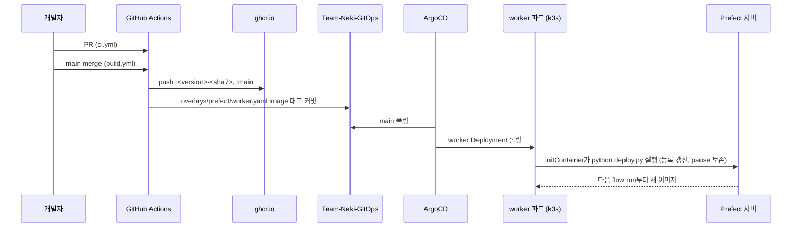

# 배포 runbook

이 문서는 Team-Neki-Workflow의 코드가 k3s 클러스터의 Prefect까지 가는 경로와, 처음 한 번
준비할 것, merge할 때 확인할 것, 실패했을 때 어디를 볼지를 다룹니다.

## 코드는 어떤 경로로 클러스터에 들어가나?

Prefect 서버는 클러스터 밖에 노출되어 있지 않습니다. 따라서 GitHub Actions는 서버에
접근하지 않고, 이미지를 밀고 GitOps 레포의 태그를 바꾸는 것까지만 합니다. deployment
등록은 worker 파드가 뜰 때 initContainer가 클러스터 안에서 합니다.



한 번 merge하면 다음 flow run부터 새 코드가 돕니다. 이미 실행 중인 flow run은 예전
이미지로 끝까지 갑니다. 태그는 `<pyproject version>-<git sha 7자리>`이며 `main` 태그도
같은 이미지를 가리킵니다.

## 처음 한 번만 하는 것

### GitOps 토큰은 무엇이고 어디에 있나?

Actions가 기본으로 받는 `GITHUB_TOKEN`은 자기 저장소에만 쓸 수 있습니다. build.yml은
다른 저장소(Team-Neki-GitOps)에 커밋을 push하므로 그쪽 `contents: write` 권한이 있는
PAT(personal access token)가 따로 필요합니다.

이 토큰은 이미 Team-Neki 조직에 `GITOPS_PAT`라는 organization secret으로 있습니다.
Team-Neki-Server 등 다른 저장소의 CI가 같은 용도로 쓰는 것입니다. 새로 만들 필요 없이
이 저장소가 그 secret을 볼 수 있게만 하면 됩니다. organization secret은 값을 다시 읽을
수 없으므로, 같은 값을 repository secret으로 복사하는 방식은 쓸 수 없습니다.

1. GitHub에서 Team-Neki 조직 > Settings > Secrets and variables > Actions
2. `GITOPS_PAT` > Repository access > Team-Neki-Workflow 추가

`gh`로 하면 다음과 같습니다. 조직 admin 권한이 필요합니다.

```bash
repo_id=$(gh api /repos/Team-Neki/Team-Neki-Workflow --jq .id)
gh api -X PUT /orgs/Team-Neki/actions/secrets/GITOPS_PAT/repositories/$repo_id
```

확인은 이 저장소에서 보이는 organization secret 목록으로 합니다. `GITOPS_PAT`가 나오면
됩니다.

```bash
gh api /repos/Team-Neki/Team-Neki-Workflow/actions/organization-secrets --jq '.secrets[].name'
```

토큰을 새로 발급해야 한다면(만료됐거나 발급자가 팀을 떠났을 때) fine-grained PAT로
만듭니다.

- 발급 위치 : 개인 Settings > Developer settings > Personal access tokens > Fine-grained tokens
- Resource owner : Team-Neki
- Repository access : Only select repositories > Team-Neki-GitOps
- Permissions : Contents > Read and write (Metadata는 자동으로 붙음)
- 저장 위치 : 조직 secret `GITOPS_PAT`의 값을 갱신. 쓰는 저장소 전부에 한 번에 반영됨

PAT는 발급한 사람의 권한으로 동작합니다. 그 사람이 Team-Neki-GitOps에 write 권한이
없으면 push가 거부됩니다. 커밋 작성자는 build.yml이 `github-actions[bot]`으로 지정하므로
누가 발급했든 GitOps 이력에는 bot으로 남습니다.

### GHCR 패키지란?

GHCR(GitHub Container Registry)은 GitHub이 제공하는 컨테이너 이미지 저장소로, 주소가
`ghcr.io`입니다. Docker Hub에 이미지를 올리듯 여기에 올리며, 올라간 이미지 하나(태그
묶음)를 GitHub은 패키지(package)라고 부릅니다. build.yml이 처음 push하는 순간
`ghcr.io/team-neki/team-neki-workflow` 패키지가 생기고, Team-Neki 조직의 Packages 탭과
이 저장소 페이지의 Packages 영역에 보입니다.

패키지는 private로 생길 수 있습니다. 클러스터에는 GHCR 자격증명이 없으므로, private이면
worker 파드가 `ImagePullBackOff`로 멈춥니다. public으로 바꾸면 인증 없이 당길 수 있는
장점이 있지만, 이미지에 든 코드가 누구에게나 공개되는 트레이드 오프가 있습니다. 저장소
자체가 이미 public이고 이미지에 비밀값을 넣지 않으므로 감수할 만합니다. private을
유지하려면 대신 GitOps 쪽에서 imagePullSecret을 만들어 worker와 base job template
양쪽에 붙여야 합니다.

visibility는 Actions로 바꿀 수 없어 첫 push 뒤 한 번 손으로 합니다.

1. `https://github.com/orgs/Team-Neki/packages/container/team-neki-workflow/settings`
2. Danger Zone > Change package visibility > Public

확인은 로그아웃 상태로 당겨보는 것이 확실합니다.

```bash
docker logout ghcr.io
docker pull ghcr.io/team-neki/team-neki-workflow:main
```

### 클러스터 쪽에 있어야 하는 것

이 저장소가 아니라 Team-Neki-GitOps `overlays/prefect/`에 있어야 하는 것들입니다.
하나라도 빠지면 아래 "어디서 실패하나"의 증상으로 드러납니다.

- `worker.yaml`의 register-deployments initContainer와 prefect-worker 컨테이너가 `image: ghcr.io/team-neki/team-neki-workflow:<태그>`를 씀 : build.yml이 이 `image:` 줄들을 같은 태그로 바꿈 (admin-web과 같은 방식)
- 위 initContainer가 `/opt/prefect`에서 `python deploy.py`를 실행함
- initContainer env : `PREFECT_API_URL`, `PREFECT_WORK_POOL=neki-pool`
- k8s Secret `prefect-workflow` (`workflow-secret.yaml`, gitignore) : `KAKAO_API_KEY`, `DATABASE_URL`. `worker-base-job-template.json`의 `envFrom`이 이 Secret을 flow run Job 파드에 넣음. **worker.yaml에 env를 넣어도 flow에는 전달되지 않음**. Secret이 없으면 모든 flow run이 `CreateContainerConfigError`로 뜨지 않음

## merge할 때 확인하는 것

1. PR에서 `ci` 워크플로가 통과했는지 봅니다. `make check`와 `make image`를 돌립니다
2. merge 뒤 Actions 탭에서 `build` 워크플로가 끝나기를 기다립니다. "Resolve image tag" 단계 출력의 태그를 적어둡니다
3. Team-Neki-GitOps main에 `chore(prefect): update image to <태그>` 커밋이 생겼는지 봅니다
4. ArgoCD가 동기화하면 worker가 롤링됩니다. initContainer 로그에 `이미지:` 줄과 deployment마다 `등록:` 줄이 보이면 등록이 끝난 것입니다. 꺼둔 스케줄이 있었다면 `pause 상태 복원:` 줄도 같이 나옵니다
5. Prefect UI에서 deployment 하나를 열어 job variables의 `image`가 새 태그인지 봅니다. `hello/hello-local`을 한 번 실행해 Job 파드가 뜨고 완료되면 끝입니다

```bash
kubectl -n prefect rollout status deploy/prefect-worker
kubectl -n prefect logs deploy/prefect-worker --all-containers --tail=50
```

문서(`*.md`)만 바뀐 merge는 build.yml이 돌지 않습니다.

## 다시 배포하거나 되돌리려면?

### 같은 커밋을 다시 밀기

Actions 탭 > build > Run workflow (main). 같은 sha라 태그가 같고, 이미지는 덮어 쓰이며,
GitOps 쪽은 바뀐 것이 없어 `already at <태그>`로 끝납니다. worker는 재시작되지 않으므로
deployment 등록도 갱신되지 않습니다. 등록만 다시 하고 싶다면 worker를 재시작합니다.

```bash
kubectl -n prefect rollout restart deploy/prefect-worker
```

### 이전 이미지로 되돌리기

GHCR에 이전 태그가 남아 있으므로 GitOps `worker.yaml`의 `image:` 줄들을 그 태그로 바꿔 커밋하면
됩니다. initContainer와 worker 컨테이너 두 곳이므로 둘을 같이 바꿔야 합니다.
Actions를 거치지 않습니다. 다음 merge가 다시 최신으로 덮으므로, 코드 자체를 되돌려야
한다면 이 저장소에서 revert PR을 올리는 것이 맞습니다.

```bash
cd Team-Neki-GitOps
# macOS/Linux 공통. (GNU sed 만 있는 CI 와 달리 로컬 BSD sed 는 -i 인자 형식이 달라 perl 을 쓴다)
perl -pi -e 's#^(\s*image: )ghcr.io/team-neki/team-neki-workflow:.*#${1}ghcr.io/team-neki/team-neki-workflow:0.1.0-a1b2c3d#' \
  overlays/prefect/worker.yaml
grep -n 'image: ghcr.io/team-neki/team-neki-workflow:' overlays/prefect/worker.yaml  # 두 줄 모두 새 태그인지 확인
git commit -am "chore(prefect): rollback image to 0.1.0-a1b2c3d" && git push
```

### 클러스터 밖에서 직접 등록하기

initContainer를 기다리지 않고 지금 등록을 갱신하려면 터널을 열고 `make deploy`를 씁니다.
이미지 밖에서 실행하므로 `WORKFLOW_IMAGE`를 직접 넘겨야 합니다. 넘기지 않으면 새로
만들어지는 deployment는 이미지 없이 등록되어 flow run이 기본 prefect 이미지로 뜹니다.

```bash
kubectl -n prefect port-forward svc/prefect-server 4200:4200
WORKFLOW_IMAGE=ghcr.io/team-neki/team-neki-workflow:main make deploy WORK_POOL=neki-pool
```

### 스케줄을 잠시 끄기

Prefect UI에서 deployment를 pause합니다. `deploy.py`가 배포 전 상태를 읽어 되돌리므로
이후 merge에도 꺼진 채로 유지됩니다. 반대로 UI에서 다시 켠 것을 배포가 끄지도 않습니다.

## 어디서 실패하나?

| 증상 | 원인 | 조치 |
|---|---|---|
| build.yml "Update image tag" 단계가 `참조를 찾지 못했다` 또는 `N 개 중 M 개만 갱신됐다`로 실패 | GitOps `worker.yaml`의 `image:` 줄이 없거나 이미지 이름이 다름 | `overlays/prefect/worker.yaml`의 `image: ghcr.io/team-neki/team-neki-workflow:<태그>` 줄 확인. 아래 주의 |
| build.yml "Check GitOps token" 단계에서 `GITOPS_PAT 가 이 저장소에서 보이지 않는다` | 조직 secret이 이 저장소에 열려 있지 않음 | 위 "GitOps 토큰" 절차 |
| GitOps checkout 또는 push에서 403 | `GITOPS_PAT`가 만료됐거나 발급자에게 GitOps write 권한이 없음 | 위 "GitOps 토큰" 절차의 재발급 |
| worker 파드 `ImagePullBackOff` | 패키지가 private이거나 태그가 없음 | 패키지를 public으로. 태그는 Actions 로그와 대조 |
| initContainer가 `work pool이 지정되지 않았습니다`로 종료 | `PREFECT_WORK_POOL` env 누락 | GitOps worker 매니페스트 |
| flow run 파드에서 `ModuleNotFoundError: flows` | deployment에 `image`가 없어 기본 prefect 이미지로 뜸 | initContainer 로그에 `이미지:` 줄이 있는지 확인. 없으면 `WORKFLOW_IMAGE`가 구워지지 않은 이미지 |
| flow run Job 파드가 `CreateContainerConfigError` | GitOps `prefect-workflow` Secret이 클러스터에 없음 | `kubectl -n prefect get secret prefect-workflow`. 없으면 `workflow-secret.yaml` apply |
| `legal-dong`, `subway-station`이 `DATABASE_URL 환경변수가 없습니다`로 실패 | Secret에 `DATABASE_URL` 키가 비어 있음 | Secret 값 채우고 다시 apply. 다음 run부터 반영 |
| `DATABASE_URL`은 있는데 `connection refused` | HOST를 `localhost`로 적음. 파드 안의 localhost는 파드 자신 | 노드 IP 또는 클러스터 Service 주소로 |
| worker가 `prefect_kubernetes` import 실패로 못 뜸 | `pyproject.toml`의 prefect 버전이 Dockerfile 베이스와 다름 | 둘을 맞추고 `make image`로 확인 (assert가 잡음) |
| 꺼둔 스케줄이 되살아남 | `deploy.py`를 거치지 않고 `prefect deploy` 등을 직접 호출함 | 등록은 `deploy.py`로만 |

**`worker.yaml`에서 이 이미지를 참조하는 컨테이너를 추가하거나 빼면 build.yml의 갱신
스텝을 같이 봐야 합니다.** build.yml은 `image: ghcr.io/team-neki/team-neki-workflow:` 로
시작하는 줄을 전부 `sed`로 바꾸고, 바뀐 개수가 갱신 전 참조 개수와 같은지 대조합니다.
이미지 이름을 바꾸거나 태그를 다른 형태로 적으면 참조를 못 찾아 CI가 실패하고, 이는
의도된 동작입니다. 조용히 배포만 안 되는 상태보다 낫습니다.

파드 안을 직접 봐야 할 때는 실행 중인 이미지로 셸을 엽니다. 파드는 uid 1001, 읽기 전용
루트로 뜨므로 로컬에서도 같은 조건으로 재현하는 것이 좋습니다.

```bash
docker run --rm -it --user 1001 --read-only -e HOME=/tmp --tmpfs /tmp \
  ghcr.io/team-neki/team-neki-workflow:main bash
```

## 정리

**정리하면, Actions는 이미지와 GitOps 태그까지만 책임지고, 등록은 worker가 뜰 때 클러스터
안에서 일어납니다.** 처음 한 번 `GITOPS_PAT`를 이 저장소에 열고 GHCR 패키지를 public으로
바꿔두면, 이후에는 merge 뒤 build 워크플로, GitOps 커밋, worker 롤링 세 가지만 보면 됩니다.
